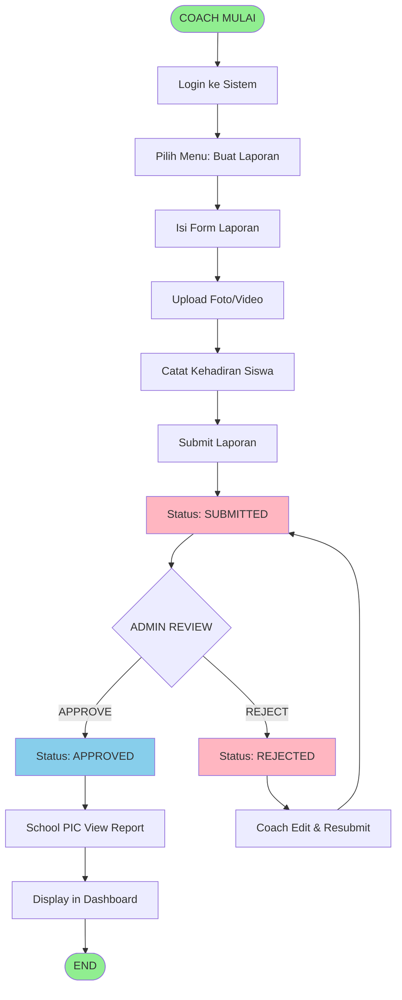

# 💼 Proses Bisnis Sistem

## 1. Business Process Overview

```
┌────────────────────────────────────────────────────────────────────────┐
│                    LEARNING REPORT SYSTEM WORKFLOWS                    │
└────────────────────────────────────────────────────────────────────────┘

┌─────────────────────────────┐
│  ADMIN SETUP (Awal)         │
├─────────────────────────────┤
│ 1. Buat user admin          │
│ 2. Buat data sekolah        │
│ 3. Buat data kelas          │
│ 4. Buat user coach          │
│ 5. Assign coach ke kelas    │
│ 6. Buat daftar siswa        │
└────────────┬────────────────┘
             │
             ▼
┌─────────────────────────────┐
│  COACH WORKFLOW             │
├─────────────────────────────┤
│ 1. Login                    │
│ 2. Lihat kelas assign       │
│ 3. Buat laporan baru        │
│ 4. Isi data laporan         │
│ 5. Catat kehadiran siswa    │
│ 6. Upload foto/video        │
│ 7. Submit laporan           │
│ STATUS: draft → submitted   │
└────────────┬────────────────┘
             │
             ▼
┌─────────────────────────────┐
│  ADMIN REVIEW               │
├─────────────────────────────┤
│ 1. Login                    │
│ 2. Lihat pending reports    │
│ 3. Review detail laporan    │
│ 4. Lihat foto/video bukti   │
│ 5. APPROVE atau REJECT      │
│                             │
│ IF APPROVED:                │
│  STATUS: approved           │
│  PIC bisa lihat laporan     │
│                             │
│ IF REJECTED:                │
│  STATUS: rejected           │
│  Coach bisa edit & resubmit │
└────────────┬────────────────┘
             │
             ▼
┌─────────────────────────────┐
│  SCHOOL PIC VIEW            │
├─────────────────────────────┤
│ 1. Login                    │
│ 2. Dashboard laporan        │
│ 3. Filter by kelas/tanggal  │
│ 4. Lihat laporan approved   │
│ 5. View detail + bukti      │
└─────────────────────────────┘
```

---

## 2. Workflow Rinci: Pembuatan Laporan

### 2.1 Alur Coach Submit Laporan

```
TAHAP 1: PERSIAPAN
┌─────────────────────────────────────────┐
│ Coach login ke sistem                   │
│ ↓                                       │
│ Coach ke menu "Buat Laporan Baru"       │
│ ↓                                       │
│ System load: Daftar kelas yang di-assign
│ (via query: coach_classes where coach_id = login_id)
│ ↓                                       │
│ Coach pilih kelas                       │
│ System load: Daftar siswa di kelas      │
│ (untuk catat kehadiran)                 │
└─────────────────────────────────────────┘

TAHAP 2: PENGISIAN DATA
┌─────────────────────────────────────────┐
│ Coach isi form:                         │
│ • Tanggal laporan                       │
│ • Materi pembelajaran (max 1000 char)  │
│ • Ringkasan aktivitas (max 2000 char)  │
│ • Catatan (optional)                   │
│ • Catat kehadiran setiap siswa:         │
│   - Hadir                               │
│   - Alpa                                │
│   - Sakit                               │
│   - Izin                                │
└─────────────────────────────────────────┘

TAHAP 3: UPLOAD MEDIA
┌─────────────────────────────────────────┐
│ Coach upload foto (max 10 files):       │
│ • System validate: harus image file     │
│ • Kirim ke Cloudinary API               │
│ • Simpan URL di report_media (type:photo)
│                                         │
│ Coach upload video (max 3 files):       │
│ • System validate: harus video file     │
│ • Supported: mp4, mov, avi, mkv, webm  │
│ • Kirim ke Cloudinary API               │
│ • Simpan URL di report_media (type:video)
└─────────────────────────────────────────┘

TAHAP 4: SUBMIT
┌─────────────────────────────────────────┐
│ Coach klik \"Submit Laporan\"            │
│ ↓                                       │
│ System validate semua field             │
│ ↓                                       │
│ CREATE reports row:                     │
│ • coach_id = login user id              │
│ • school_id = dari class.school_id      │
│ • class_id = dari form                  │
│ • report_date = dari form               │
│ • status = 'submitted'                  │
│ • created_at = now()                    │
│ ↓                                       │
│ CREATE report_attendances (per student) │
│ ↓                                       │
│ CREATE report_media (per file)          │
│ ↓                                       │
│ Redirect: /coach/reports                │
│ Flash: \"Laporan berhasil dikirim!\"     │
└─────────────────────────────────────────┘

HASIL:
┌─────────────────────────────────────────┐
│ Coach dapat:                            │
│ • Lihat laporan di daftar dengan status │
│   'submitted'                           │
│ • Edit laporan jika status 'rejected'   │
│ • Tidak bisa edit jika sudah 'approved' │
│                                         │
│ Admin dapat:                            │
│ • Lihat laporan di dashboard pending    │
│ • Review detail laporan                 │
│ • Approve atau reject                   │
└─────────────────────────────────────────┘
```

### 2.2 Data yang Disimpan Saat Submit

```
reports table:
┌─────────────────────────────────────┐
│ id: [auto]                          │
│ coach_id: 5                         │
│ school_id: 2                        │
│ class_id: 8                         │
│ report_date: 2026-03-15             │
│ lesson_material: \"Pembelajaran ...\" │
│ activity_summary: \"Aktivitas ...\"   │
│ notes: \"Catatan ...\" atau NULL     │
│ status: 'submitted'                 │
│ admin_notes: NULL                   │
│ approved_by: NULL                   │
│ approved_at: NULL                   │
└─────────────────────────────────────┘

report_attendances table (1 row per siswa):
┌─────────────────────────────────────┐
│ id: [auto]                          │
│ report_id: [laporan id yang baru]   │
│ student_id: 1                       │
│ status: 'present'                   │
│ ─────────────────────────────────── │
│ report_id: [laporan id yang baru]   │
│ student_id: 2                       │
│ status: 'absent'                    │
│ ─────────────────────────────────── │
│ ... (sesuai jumlah siswa di kelas)  │
└─────────────────────────────────────┘

report_media table (1 row per file):
┌─────────────────────────────────────┐
│ id: [auto]                          │
│ report_id: [laporan id yang baru]   │
│ type: 'photo'                       │
│ path: https://cloudinary.com/...    │
│ original_name: \"IMG_123.jpg\"       │
│ ─────────────────────────────────── │
│ report_id: [laporan id yang baru]   │
│ type: 'video'                       │
│ path: https://cloudinary.com/...    │
│ original_name: \"video_123.mp4\"     │
│ ... (sesuai jumlah file upload)     │
└─────────────────────────────────────┘
```

---

## 3. Workflow Rinci: Admin Review & Approval

### 3.1 Alur Admin Review

```
TAHAP 1: LIHAT DAFTAR PENDING
┌─────────────────────────────────────┐
│ Admin login                         │
│ ↓                                   │
│ Admin ke menu \"Laporan\"             │
│ ↓                                   │
│ System query: SELECT reports WHERE  │
│   status = 'submitted'              │
│ ↓                                   │
│ Admin lihat list laporan pending    │
│ • Coach name                        │
│ • Sekolah                           │
│ • Kelas                             │
│ • Tanggal submit                    │
└─────────────────────────────────────┘

TAHAP 2: REVIEW DETAIL
┌─────────────────────────────────────┐
│ Admin klik laporan untuk detail      │
│ ↓                                   │
│ System load report dengan relations:│
│ • coach data                        │
│ • school data                       │
│ • class data                        │
│ • attendance list + student names   │
│ • media (photos + videos)           │
│ ↓                                   │
│ Admin lihat:                        │
│ • Materi pembelajaran               │
│ • Ringkasan aktivitas               │
│ • Catatan                           │
│ • Kehadiran siswa (tabel)           │
│ • Foto bukti                        │
│ • Video bukti                       │
│ • Total present, absent, sick, izin │
└─────────────────────────────────────┘

TAHAP 3: KEPUTUSAN
┌─────────────────────────────────────┐
│ Admin punya 2 pilihan:              │
│                                     │
│ OPTION A: APPROVE                   │
│ ├─ Klik tombol \"Setujui\"            │
│ ├─ UPDATE reports SET:              │
│ │  • status = 'approved'            │
│ │  • approved_by = admin_id         │
│ │  • approved_at = now()            │
│ ├─ Flash: \"Laporan berhasil...\"   │
│ └─ PIC sekarang bisa lihat          │
│                                     │
│ OPTION B: REJECT                    │
│ ├─ Klik tombol \"Tolak\"              │
│ ├─ Modal form: input reason         │
│ ├─ UPDATE reports SET:              │
│ │  • status = 'rejected'            │
│ │  • admin_notes = reason           │
│ ├─ Flash: \"Laporan ditolak...\"    │
│ └─ Coach bisa edit & resubmit       │
└─────────────────────────────────────┘

TAHAP 4: NOTIFIKASI COACH (manual)
┌─────────────────────────────────────┐
│ Coach melihat di dashboard:         │
│ • Laporan status berubah            │
│ • IF approved: \"Laporan disetujui\"  │
│ • IF rejected: \"Laporan ditolak\"   │
│   + admin notes visible             │
│ ↓                                   │
│ IF rejected:                        │
│ • Coach bisa klik \"Edit Laporan\"   │
│ • Coach edit dan resubmit           │
│ • Status kembali \"submitted\"       │
│ • Admin review ulang                │
└─────────────────────────────────────┘
```

---

## 4. Workflow Rinci: School PIC View Reports

### 4.1 Alur School PIC

```
TAHAP 1: LOGIN & DASHBOARD
┌─────────────────────────────────────┐
│ School PIC login                    │
│ • auth.user.role = 'school_pic'     │
│ • auth.user.school_id = [school_id] │
│ ↓                                   │
│ PIC ke menu \"Dashboard\"             │
│ ↓                                   │
│ System query:                       │
│ SELECT reports WHERE                │
│   school_id = [pic.school_id] AND   │
│   status = 'approved'               │
│ ↓                                   │
│ Dashboard menampilkan:              │
│ • Total reports approved            │
│ • Reports this month                │
│ • List laporan dengan filter options│
└─────────────────────────────────────┘

TAHAP 2: FILTER & SEARCH
┌─────────────────────────────────────┐
│ PIC bisa filter by:                 │
│ • Kelas (class_id)                  │
│ • Tanggal dari (date_from)          │
│ • Tanggal sampai (date_to)          │
│ ↓                                   │
│ System re-query dengan filters      │
│ ↓                                   │
│ Tampilkan hasil filtered            │
│ (pagination: 20 per page)           │
└─────────────────────────────────────┘

TAHAP 3: LIHAT DETAIL
┌─────────────────────────────────────┐
│ PIC klik laporan di list            │
│ ↓                                   │
│ System verify:                      │
│ • report.school_id = pic.school_id? │
│ • report.status = 'approved'?       │
│ ↓                                   │
│ IF valid: tampilkan detail          │
│ • Coach name                        │
│ • Tanggal laporan                   │
│ • Materi & aktivitas                │
│ • Catatan                           │
│ • Kehadiran siswa (tabel)           │
│ • Foto bukti (thumbnail)            │
│ • Video bukti (player)              │
│ ↓                                   │
│ IF invalid: 403 Forbidden           │
└─────────────────────────────────────┘
```

---

## 5. Data Sensitivity & Permissions Matrix

```
┌─────────────────────────────────────────────────────────────┐
│ RESOURCE: Reports                                           │
├─────────────────────────────────────────────────────────────┤
│ Action          │ Admin │ Coach │ PIC  │ Others            │
├─────────────────┼───────┼───────┼──────┼───────────────────┤
│ Create          │ ❌    │ ✅    │ ❌   │ ❌ (draft/submit)  │
│ List All        │ ✅    │ ❌    │ ❌   │ ❌                 │
│ List Own        │ N/A   │ ✅    │ N/A  │ ❌                 │
│ List School     │ N/A   │ N/A   │ ✅   │ ❌ (approved only) │
│ View Detail     │ ✅    │ ✅    │ ✅*  │ ❌                 │
│ Edit (draft)    │ ❌    │ ✅    │ ❌   │ ❌                 │
│ Edit (rejected) │ ❌    │ ✅    │ ❌   │ ❌                 │
│ Approve         │ ✅    │ ❌    │ ❌   │ ❌                 │
│ Reject          │ ✅    │ ❌    │ ❌   │ ❌                 │
│ Delete          │ ❌    │ ❌    │ ❌   │ ❌                 │
│ *PIC: only if approved + same school                       │
└─────────────────────────────────────────────────────────────┘

┌─────────────────────────────────────────────────────────────┐
│ RESOURCE: Users                                             │
├─────────────────────────────────────────────────────────────┤
│ Action          │ Admin │ Coach │ PIC  │ Others            │
├─────────────────┼───────┼───────┼──────┼───────────────────┤
│ List All        │ ✅    │ ❌    │ ❌   │ ❌                 │
│ View Own        │ ✅    │ ✅    │ ✅   │ ❌                 │
│ View Others     │ ✅    │ ❌    │ ❌   │ ❌                 │
│ Create          │ ✅    │ ❌    │ ❌   │ ❌                 │
│ Update          │ ✅    │ ❌    │ ❌   │ ❌ (not self)      │
│ Delete Self     │ ❌    │ ❌    │ ❌   │ ❌                 │
│ Delete Others   │ ✅    │ ❌    │ ❌   │ ❌                 │
│ Reset Password  │ ✅    │ ❌    │ ❌   │ ❌                 │
└─────────────────────────────────────────────────────────────┘

┌─────────────────────────────────────────────────────────────┐
│ RESOURCE: Classes & Students                                │
├─────────────────────────────────────────────────────────────┤
│ Action          │ Admin │ Coach │ PIC  │ Others            │
├─────────────────┼───────┼───────┼──────┼───────────────────┤
│ List Classes    │ ✅    │ ✅    │ ✅   │ ❌                 │
│ Create Class    │ ✅    │ ❌    │ ❌   │ ❌                 │
│ Delete Class    │ ✅    │ ❌    │ ❌   │ ❌                 │
│ List Students   │ ✅    │ ✅    │ ✅   │ ❌                 │
│ Add Student     │ ✅    │ ✅    │ ❌   │ ❌                 │
│ Import Students │ ✅    │ ✅    │ ❌   │ ❌                 │
│ Delete Student  │ ✅    │ ✅    │ ❌   │ ❌                 │
└─────────────────────────────────────────────────────────────┘
```

---

## 6. Error Scenarios & Handling

### Scenario 1: Coach Edit Laporan yang Sudah Approved
```
Coach mencoba: PUT /coach/reports/5 (sudah approved)
System check:
  ├─ $report->coach_id === Auth::id()? ✓
  ├─ $report->status === 'draft' || 'rejected'? ✗
  └─ Abort 403: \"Laporan tidak bisa diedit.\"
Result: Error shown to coach
```

### Scenario 2: Admin Delete School dengan Kelas & Laporan
```
Admin: DELETE /admin/schools/1

Database cascade:
1. schools DELETE 1
2. ↓ (cascade)
3. classes DELETE where school_id=1
4. ↓ (cascade)
5. coach_classes DELETE where class_id IN (1,2,3)
6. students DELETE where class_id IN (1,2,3)
7. reports DELETE where school_id=1
8. ↓ (cascade)
9. report_attendances DELETE
10. report_media DELETE

Result: Complete cleanup, no orphaned records
```

### Scenario 3: School PIC Access Report dari Sekolah Lain
```
PIC from School A tries:
  GET /pic/reports/42 (report from School B)

System check:
  ├─ $report->school_id === Auth::user()->school_id?
  │  (42.school_id = School B, Auth.school_id = School A)
  │  ✗ NOT EQUAL
  └─ Abort 403: Forbidden

Result: 403 error
```

---

## 7. Concurrent Access Handling

### Scenario: Dua Coach Edit Laporan Bersamaan

```
Coach A: GET /coach/reports/5/edit
Coach B: GET /coach/reports/5/edit

Keduanya load form (OK, read-only operation)

Coach A: PUT /coach/reports/5
  ├─ UPDATE reports SET
  │  ├─ lesson_material = [Coach A changes]
  │  ├─ activity_summary = [Coach A changes]
  │  └─ updated_at = now()
  └─ ✓ Success

Coach B: PUT /coach/reports/5
  ├─ UPDATE reports SET
  │  ├─ lesson_material = [Coach B changes]
  │  ├─ activity_summary = [Coach B changes]
  │  └─ updated_at = now()
  └─ ✓ Success (overwrites Coach A changes)

Result:
  - Last write wins
  - No lock mechanism
  - Coach A's changes lost
  - Recommendation: Add optimistic locking (updated_at check)
```

---

## 8. Workflow Diagram Lengkap (Mermaid)



